# 🏢 Architecture Campus Multi-VLAN avec Haute Disponibilité


-yellow)

> Conception et déploiement d'une infrastructure réseau d'entreprise segmentée par service, avec routage inter-VLAN centralisé et distribution automatique des adresses IP — simulée sous Cisco Packet Tracer.

---

## 🎯 En bref

Ce projet reproduit l'architecture réseau typique d'une PME répartie sur plusieurs étages : segmentation du trafic par service (Direction, Comptabilité, Ventes, Invités), routage inter-VLAN centralisé sur un switch de distribution niveau 3, et attribution automatique des adresses IP via un service DHCP relayé.

**Compétences mises en œuvre :**
- Conception d'une architecture réseau à deux niveaux (accès / distribution)
- Segmentation logique du trafic avec VLANs et trunking 802.1Q
- Routage inter-VLAN via interfaces virtuelles (SVI) sur un switch multicouche
- Sécurisation des ports d'accès (Port Security, sticky MAC)
- Déploiement d'un service DHCP centralisé avec relais (`ip helper-address`)
- Diagnostic et vérification via les commandes IOS (`show vlan`, `show interfaces trunk`, `show ip route`...)

---

## 📥 Tester le projet

Le fichier de simulation Cisco Packet Tracer (`.pkt`) est disponible dans ce dépôt : **[Campus-MultiVLAN.pkt](./Campus-MultiVLAN.pkt)**.

Ouvre-le avec [Cisco Packet Tracer](https://www.netacad.com/courses/packet-tracer) (gratuit, inscription NetAcad requise) pour :
- explorer l'ensemble des configurations des switches d'accès, du switch de distribution et du routeur,
- vérifier la table VLAN et les trunks en direct (`show vlan brief`, `show interfaces trunk`),
- tester toi-même la connectivité inter-VLAN et l'attribution DHCP en rallumant/éteignant des ports.


---

## 🗺️ Architecture

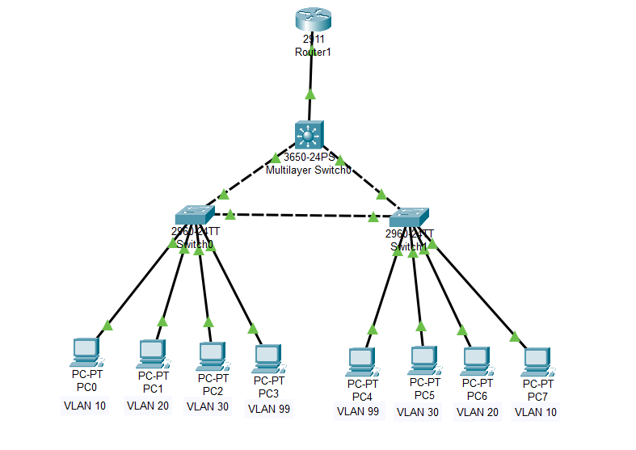

L'infrastructure repose sur :
- **1 switch de distribution niveau 3** (3650-24PS) assurant le routage inter-VLAN et la distribution DHCP,
- **2 switches d'accès** (2960-24TT) reliés au switch de distribution via des liens trunk 802.1Q, avec un lien de secours entre eux pour la redondance,
- **1 routeur** en amont, gérant les sous-interfaces 802.1Q et la table de routage vers les réseaux VLAN,
- **8 postes clients** répartis sur 4 VLANs de service.

## 🔢 Plan d'adressage

| VLAN | Service       | Réseau            | Passerelle |
|------|---------------|-------------------|------------|
| 10   | Direction     | 192.168.10.0/27   | .2         |
| 20   | Comptabilité  | 192.168.20.0/27   | .2         |
| 30   | Ventes        | 192.168.30.0/27   | .2         |
| 99   | Management    | 192.168.99.0/28   | .2         |

---

## ⚙️ Réalisations techniques

### Segmentation et nommage des VLANs

VLANs créés et propagés via VTP sur l'ensemble des switches, avec une nomenclature explicite par service.

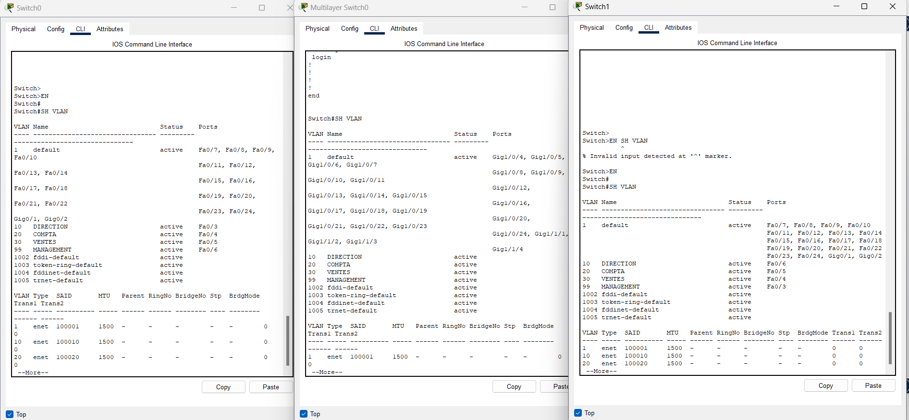

### Trunking 802.1Q avec filtrage des VLANs

Liens trunk configurés en encapsulation 802.1Q, VLAN natif dédié (VLAN 8) pour la sécurité, et VLANs autorisés restreints aux besoins réels (VLAN pruning).

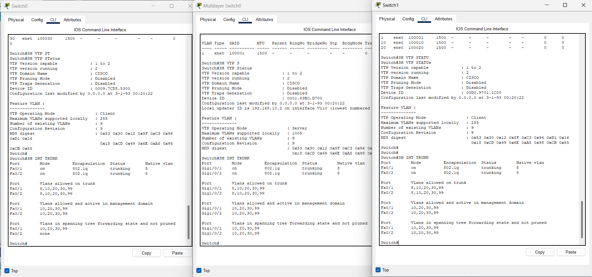

### Sécurisation des ports d'accès

Chaque port utilisateur est verrouillé par Port Security avec apprentissage MAC dynamique (`sticky`), limitant l'accès au réseau aux équipements autorisés.

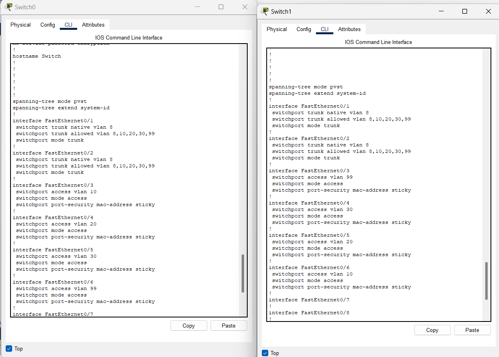

### Configuration du switch de distribution (couche 3)

Interfaces trunk vers les switches d'accès, interface routée dédiée vers le routeur, et activation du mode Rapid-PVST+ pour la prévention des boucles.

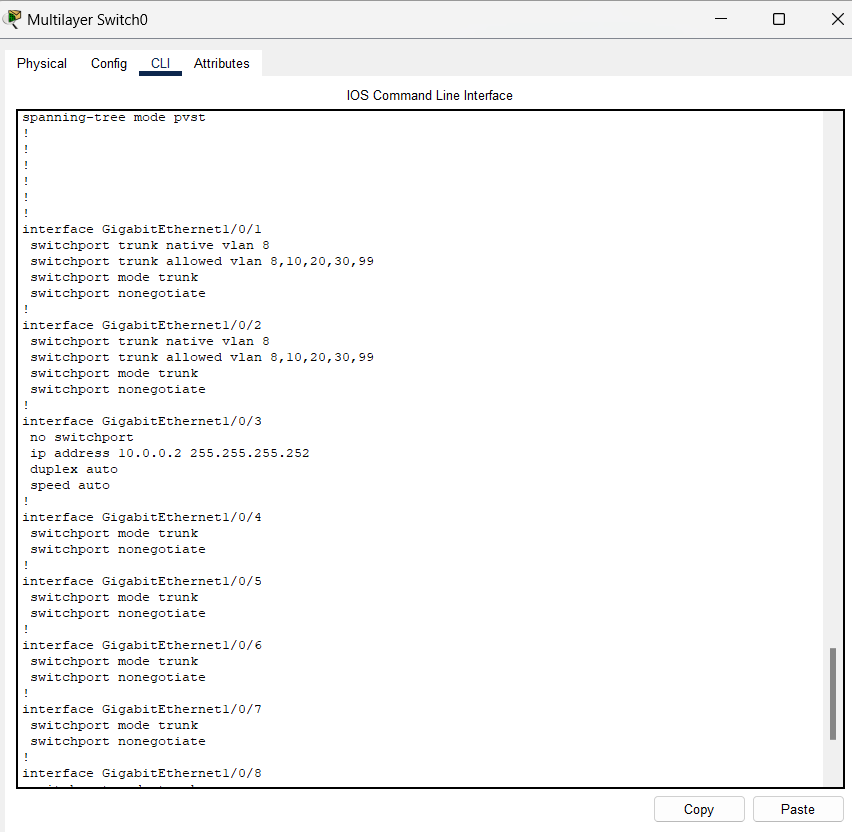

### Routage inter-VLAN via interfaces virtuelles (SVI)

Création des SVI pour chaque VLAN avec adresse MAC dédiée et relais DHCP vers le routeur central.

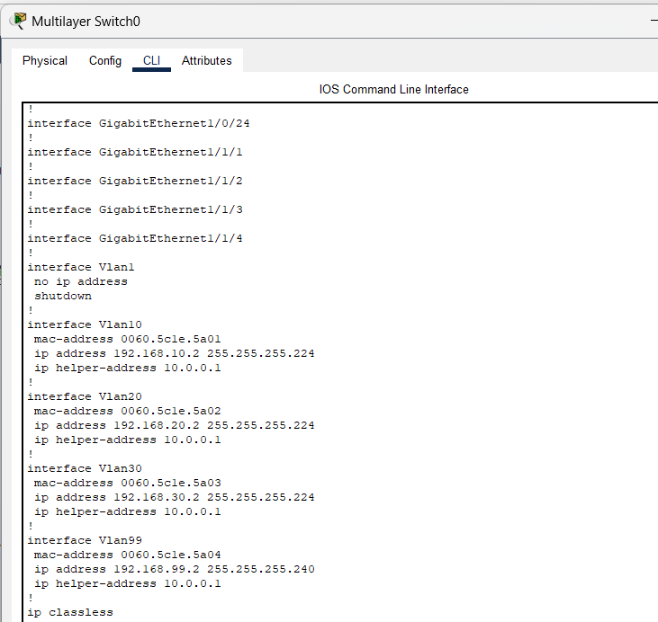

Complément côté routeur avec les sous-interfaces 802.1Q :

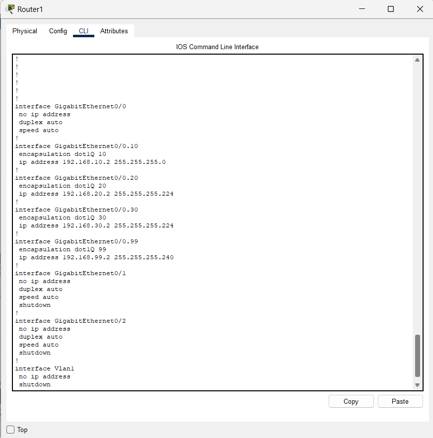

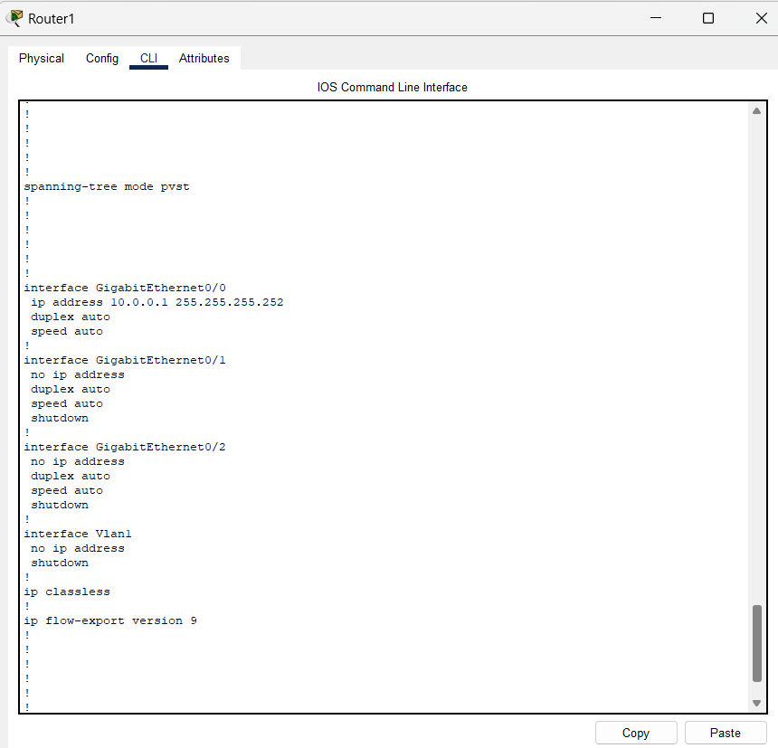

### Service DHCP centralisé

Pools DHCP dédiés par VLAN avec exclusion des adresses de gestion, et routage statique assurant l'acheminement des échanges DHCP relayés.

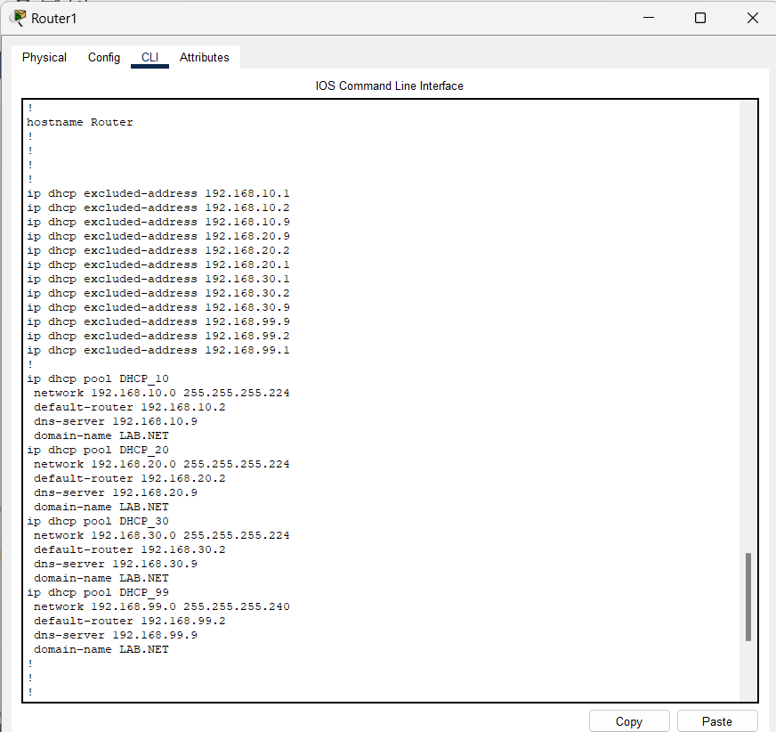

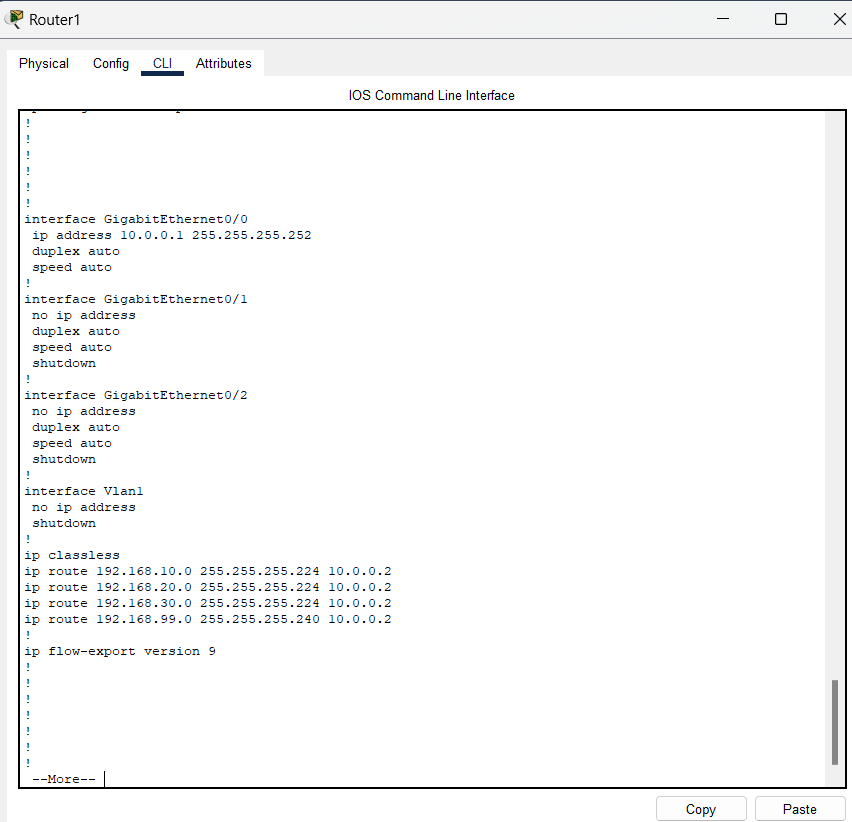

---

## ✅ Validation

### Attribution automatique des adresses IP

Les 8 postes clients obtiennent une adresse cohérente avec leur VLAN, sans configuration manuelle.

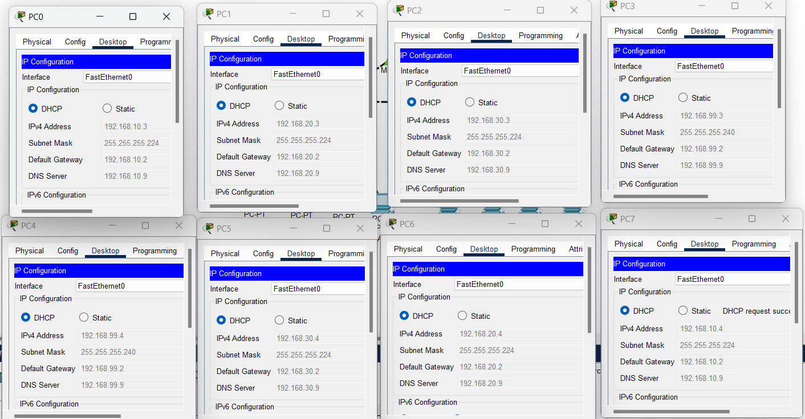

### Connectivité inter-VLAN

Tests de connectivité croisés confirmant le bon fonctionnement du routage entre les différents services.

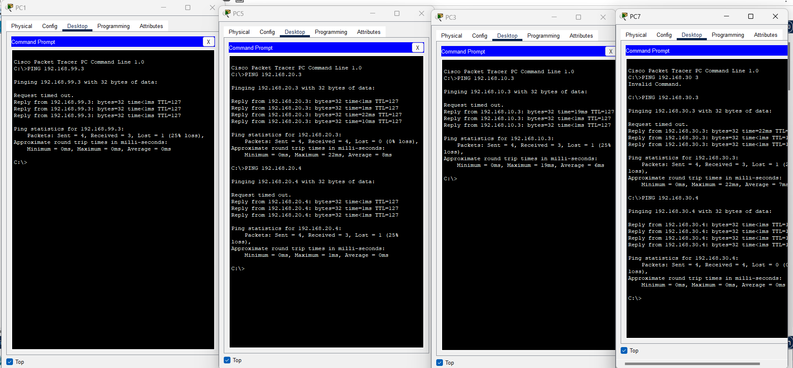

### Cohérence de la configuration VTP/VLAN

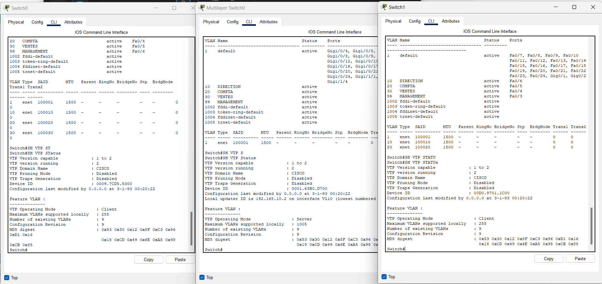

---

## 🚀 Pistes d'évolution

- Agrégation des liens critiques en **EtherChannel LACP** pour renforcer la bande passante et la tolérance aux pannes.
- Ajustement fin de la priorité **Spanning Tree** pour garantir un pont racine déterministe.
- Activation de **PortFast / BPDU Guard** sur les ports utilisateurs pour accélérer la convergence sans compromettre la sécurité.
- Mise en place d'une redondance de passerelle (HSRP/VRRP) sur le switch de distribution.

---

## 📂 Structure du dépôt

```
├── README.md
├── LICENSE
├── Campus-MultiVLAN.pkt                 ← fichier de simulation à ouvrir dans Packet Tracer
├── 01_topologie_reseau_packet_tracer.png
├── 02_switches_show_vlan_brief.png
├── 03_switches_show_interfaces_trunk_vtp.png
├── 04_multilayer_switch_trunk_and_l3_config.png
├── 05_router1_static_routes_config.png
├── 06_switches_access_trunk_and_port_security_config.png
├── 07_router1_interfaces_global_config.png
├── 08_router1_dhcp_pools_and_excluded_addresses.png
├── 09_clients_pc_dhcp_ip_configuration_verification.png
├── 10_router1_subinterfaces_dot1q_config.png
├── 11_multilayer_switch_svi_and_ip_helper_config.png
├── 12_switches_vtp_status_and_vlan_brief.png
└── 13_test_ping_inter-vlan_pc_clients.png
```

---

## 👤 Auteur

**ALAYE Odilon Alabi**

N'hésite pas à me contacter pour toute question sur ce projet ou pour échanger sur des opportunités en administration réseau / infrastructure.
